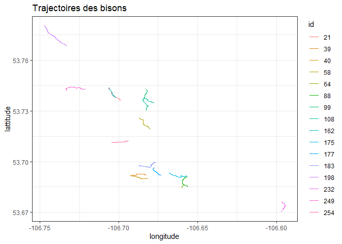
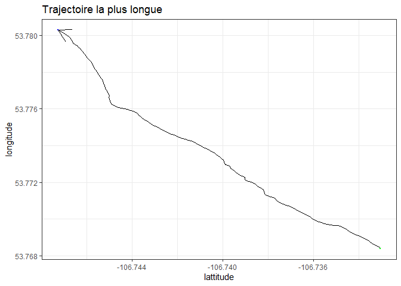
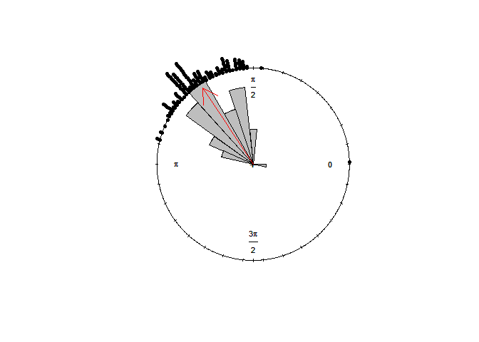
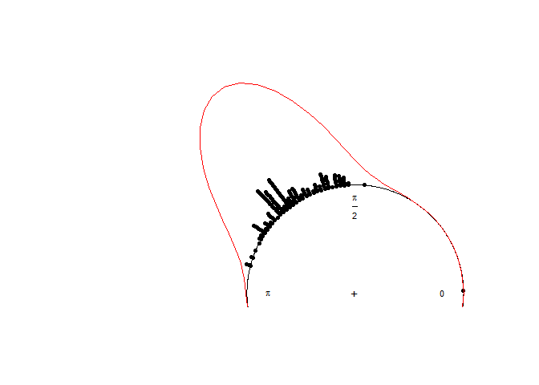
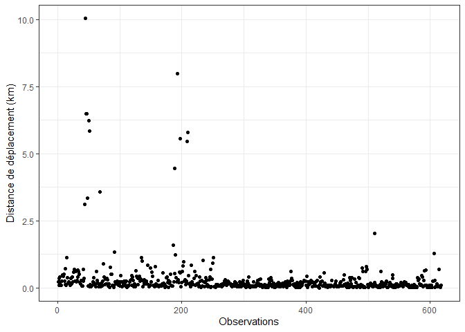
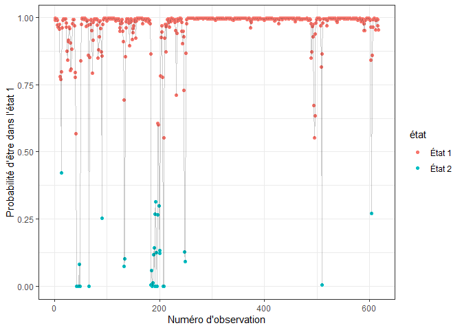
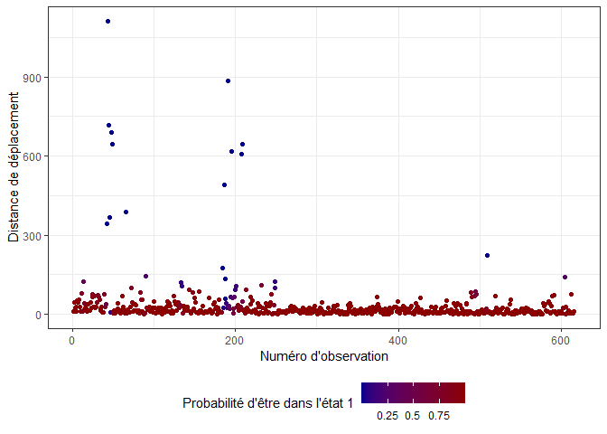

Exemple chapitre 1
================
Aurélien Nicosia

## Package R

``` r
library(tidyverse) # environnement tidyverse
library(oce) # conversion UTM vers longitute/latitude
library(circular) # statistiques directionnelles
library(survival) # modèle de régression logistique conditionnel
library(momentuHMM) # HMM
library(mixR) # Modèle de mélange
```

## Exemple 1: Sentiers de bisons

``` r
bison <- read.delim("data/bison_complet4.txt")
bison$id <- as.factor(bison$VAR3)
L <- 13 # bison à afficher
bison <- bison %>% group_by(id) %>%
  mutate(nb_step = length(x)) %>% ungroup

nb_step.unique <- unique(bison$nb_step)

conversion <-  utm2lonlat(bison$x, bison$y, zone = 13)

bison$latitude <-  conversion$latitude
bison$longitude <- conversion$longitude

bison.plot <-
  bison %>%  filter(nb_step %in% nb_step.unique[order(nb_step.unique, decreasing = TRUE)[1:L]])

p <-
  ggplot(data = bison.plot, aes(x = longitude, y = latitude, fill = id)) +
  geom_path(aes(col = id), alpha = 1) +
  ylab("lattitude") +
  xlab("longitude") +
  ggtitle("Trajectoires des bisons") +
  theme_bw()
p
```

<!-- -->

## Exemple 1.1: Sentier de bison le plus long

``` r
L <- 1 # bison à afficher

bison.plot <-
  bison %>%  filter(nb_step %in% nb_step.unique[order(nb_step.unique, decreasing = TRUE)[1:L]])

p <-
  ggplot(data = bison.plot, aes(x = longitude, y = latitude)) +
geom_path(alpha = 1, arrow = arrow()) + xlab("lattitude") +
  ylab("longitude") + ggtitle("Trajectoire la plus longue") + geom_point(
    data = head(bison.plot, 1),
    colour = "green",
    size = 0.5
  ) +
  geom_point(data = tail(bison.plot, 1),
             colour = "blue",
             size = 0.5) +
  theme_bw()
p
```

<!-- -->

## Exemple 1.2: Statistique descriptive du trajet le plus long

``` r
y <- numeric(length(bison.plot$x))
for (i in (2:length(bison.plot$x))) {
  y[i - 1] <-
    atan2(bison.plot$y[i] - bison.plot$y[i - 1], bison.plot$x[i] - bison.plot$x[i -
                                                                                  1])
}
y <- as.circular(y)
sum <- summary(y)
sum
```

    ##        n     Min.  1st Qu.   Median     Mean  3rd Qu.     Max.      Rho 
    ## 171.0000   0.0000   1.9130   2.2130   2.1590   2.3310   2.8770   0.9495

``` r
plot(y,
     stack = TRUE,
     cex = 0.7,
     tcl.text = 0.2)
rose.diag(
  y,
  bins = 30,
  col = "grey",
  cex = 0.7,
  prop = 1.8,
  add = TRUE,
  tcl.text = 0.2
)
arrows(
  x0 = 0,
  y0 = 0,
  x1 = sum[8] * cos(sum[5]),
  y1 = sum[8] * sin(sum[5]),
  col = 'red',
  lty = 1
)
```

<!-- -->

## Exemple 1.3: Estimation von Mises sur le sentier le plus long

``` r
fit <- mle.vonmises(x = y)
print(fit)
```

    ## 
    ## Call:
    ## mle.vonmises(x = y)
    ## 
    ## mu: 2.159  ( 0.0246 )
    ## 
    ## kappa: 10.18  ( 1.07 )

``` r
A1(fit$kappa) / sum[8]
```

    ##      Rho 
    ## 1.000033

``` r
plot(
  y,
  stack = TRUE,
  cex = 0.7,
  tcl.text = 0.2,
  ylim = c(0, 2),
  xlim = c(-1.5, 0.2)
)
ff <- function(x)
  dvonmises(x, mu = fit$mu, kappa = fit$kappa)
curve.circular(
  ff,
  join = TRUE,
  add = TRUE,
  xlim = c(-1.5, 0.2),
  ylim = c(0, 2),
  tcl.text = 0.2,
  cex = 0.7,
  col = "red"
)
```

<!-- -->

## Exemple 1.4: Régression angulaire sur les sentiers de bisons

``` r
source("Scripts/angular regression final.R")

bison.regression <-
    bison.plot %>%
    group_by(id) %>%
    mutate(y.dir =atan2(y-lag(y,1), x-lag(x,1)),
           y.prec = lag(y.dir, 1), y.prec2 = lag(y.dir, 2)) %>%
     rename(
    x.meadow = bearing2targetmead,
    z.meadow = dist2targetmead,
    x.gap = bearing2gap,
    z.gap = dist2gap
    )

fit <- consensus(formula = y.dir ~ y.prec + y.prec2 + x.meadow + x.meadow:log(z.meadow) +x.gap + x.gap:log(z.gap), data = bison.regression)
print(fit)
```

    ## 
    ## Maximum log-likelihood : 359.6543 
    ## 
    ## Kappa Parameters:
    ##                           estimate  robust std    z value  P(|z|>.)
    ## y.prec                  27.4519818    8.332907  3.2944065   0.00099
    ## y.prec2                 -4.2410102    3.297416  1.2861617   0.19839
    ## x.meadow                35.2307045   13.790245  2.5547555   0.01063
    ## x.gap                    2.9812628    5.158410  0.5779421   0.56330
    ## x.meadow:log(z.meadow)  -4.1731694    2.067711  2.0182559   0.04356
    ## x.gap:log(z.gap)        -0.4635389    1.182777  0.3919074   0.69513

``` r
fit2 <- update(fit, ~ . - x.gap:log(z.gap))
print(fit2)
```

    ## 
    ## Maximum log-likelihood : 359.5794 
    ## 
    ## Kappa Parameters:
    ##                           estimate  robust std   z value  P(|z|>.)
    ## y.prec                  27.6024048   8.3700061  3.297776   0.00097
    ## y.prec2                 -4.4605415   3.4483687  1.293522   0.19583
    ## x.meadow                34.4786986  13.3990287  2.573224   0.01008
    ## x.gap                    0.8834357   0.7686829  1.149285   0.25044
    ## x.meadow:log(z.meadow)  -4.0705289   2.0236717  2.011457   0.04428

## Exemple 2.1: Application du SSF sur la trajectoire du bison

``` r
dat <- read_csv("data/1051complet.csv")

# initialization parameter of the EM algorithm with a one
# state model

fit <- coxph(Surv(Times, Cote) ~ meadow + eau + strata(idstrate), data = dat, 
  x = TRUE)
fit
```

    ## Call:
    ## coxph(formula = Surv(Times, Cote) ~ meadow + eau + strata(idstrate), 
    ##     data = dat, x = TRUE)
    ## 
    ##            coef exp(coef) se(coef)      z        p
    ## meadow  2.39838  11.00539  0.04288 55.935  < 2e-16
    ## eau    -0.78027   0.45828  0.19726 -3.956 7.64e-05
    ## 
    ## Likelihood ratio test=3162  on 2 df, p=< 2.2e-16
    ## n= 64512, number of events= 3072

## Exemple 2.2: Application de l’équivalence des modèles sur la trajectoire du bison

``` r
fit <- coxph(Surv(Times, Cote) ~ meadow + eau + cos.persis + dist.neg + dist.log + strata(idstrate), data = dat, 
  x = TRUE)
fit
```

    ## Call:
    ## coxph(formula = Surv(Times, Cote) ~ meadow + eau + cos.persis + 
    ##     dist.neg + dist.log + strata(idstrate), data = dat, x = TRUE)
    ## 
    ##                coef exp(coef) se(coef)       z       p
    ## meadow      1.38810   4.00721  0.05796  23.949 < 2e-16
    ## eau        -0.67826   0.50750  0.21432  -3.165 0.00155
    ## cos.persis -0.11549   0.89093  0.03179  -3.633 0.00028
    ## dist.neg    0.21379   1.23836  0.02135  10.014 < 2e-16
    ## dist.log   -0.77656   0.45999  0.02617 -29.679 < 2e-16
    ## 
    ## Likelihood ratio test=9049  on 5 df, p=< 2.2e-16
    ## n= 64512, number of events= 3072

## Exemple 3: Estimation d’un modèle caché sur la distance parcouru d’un caribou

``` r
# load dataset
jeu <-  read.csv("data/caribou.txt", sep="") 
head(jeu)
```

    ##            y     xcut   xcenter          d
    ## 1 -0.9501786 3.403392 0.3406991 0.22648937
    ## 2 -0.1764444 3.141593 0.1535005 0.35197801
    ## 3 -2.7820763 3.141593 0.4529565 0.09254289
    ## 4  1.0495830 3.141593 1.1190466 0.40540238
    ## 5  2.7924018 3.141593 0.9552265 0.22151738
    ## 6  2.9904418 3.403392 1.4442857 0.08754275

``` r
jeu$index = 1:dim(jeu)[1]

ggplot(data = jeu, aes( x = index,y = d))+
  geom_point()+
  theme_bw()+
  ylab("Distance de déplacement (km)")+
  xlab("Observations")
```

<!-- -->

``` r
## Modèle de mélange ---

library(mixR)
mod = mixfit(jeu$d*100, family = 'gamma', ncomp = 2)
mod
```

    ## Gamma mixture model with 2 components
    ##            comp1       comp2
    ## pi     0.9363330   0.0636670
    ## mu    17.1163945 238.3846000
    ## sd    15.1528769 276.0005320
    ## shape  1.2759521   0.7459961
    ## rate   0.0745456   0.0031294
    ## 
    ## EM iterations: 73 AIC: 5089.56 BIC: 5111.68 log-likelihood: -2539.78

``` r
## HMM

# Création de positions dans l'espace 

position<- matrix(NA, nrow = nrow(jeu)+1, ncol = 2)
position[1,] <- c(0,0)

for (i in 2:(nrow(jeu)+1)){
  position[i,] <- position[i-1,] + jeu[i,]$d*c(cos(jeu[i,]$y),sin(jeu[i,]$y))
}

position <- as.data.frame(position)

# merge dataset

dat <- cbind(position[-1,]) 


# prep data

d <- prepData(dat ,coordNames=c("V1","V2") ,
              type = "LL" )

d = d %>% mutate( ID = "Caribou 1")


## fit HMM
nbStates <- 2
stepDist <- "gamma" # step distribution


# initial parameter for distance
stepPar <- c(17,238,15,276) 


m <- fitHMM(data=d,
            nbStates=nbStates,
            dist=list(step=stepDist),
            Par0=list(step=stepPar),
            stateNames = c( "Encampé","Exploratoire"))
m
```

    ## Value of the maximum log-likelihood: -2575.465 
    ## 
    ## 
    ## step parameters:
    ## ----------------
    ##       Encampé Exploratoire
    ## mean 18.81471     231.2622
    ## sd   16.75206     277.4325
    ## 
    ## Regression coeffs for the transition probabilities:
    ## ---------------------------------------------------
    ##                1 -> 2     2 -> 1
    ## (Intercept) -3.659277 -0.7799396
    ## 
    ## Transition probability matrix:
    ## ------------------------------
    ##                Encampé Exploratoire
    ## Encampé      0.9748953   0.02510466
    ## Exploratoire 0.3143329   0.68566709
    ## 
    ## Initial distribution:
    ## ---------------------
    ##      Encampé Exploratoire 
    ## 9.999992e-01 8.309064e-07

## Exemple 3.1 Décolde des états cachés sur la distance parcourues d’un caribou

``` r
## graphique de distance en fonction de probabilité smoothé

new_data = cbind(d,stateProbs(m))

new_data$`Numéro d'observation` = 1:dim(new_data)[1]
new_data$état = ifelse(new_data$Encampé>0.5, "État 1", "État 2")

ggplot(data = new_data,aes( x = `Numéro d'observation`, y = Encampé))+
  geom_point(aes(color = état))+
  geom_line(alpha = 0.2)+
  theme_bw()+
  ylab("Probabilité d'être dans l'état 1")
```

<!-- -->

``` r
ggplot(data = new_data,aes( x = `Numéro d'observation`, y = step, color = Encampé))+
  geom_point()+
  theme_bw()+
  scale_color_gradient(low = "darkblue", high = "darkred",
                       breaks = c(0, 0.25, 0.5, 0.75, 1),
                       labels = c("0", "0.25", "0.5", "0.75", "1")) +
  ylab("Distance de déplacement")+
  labs(color = "Probabilité d'être dans l'état 1")+
  theme(legend.position = "bottom")
```

<!-- -->
