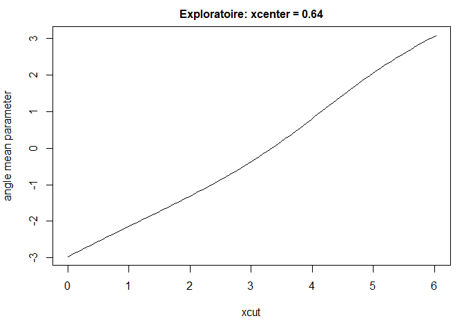
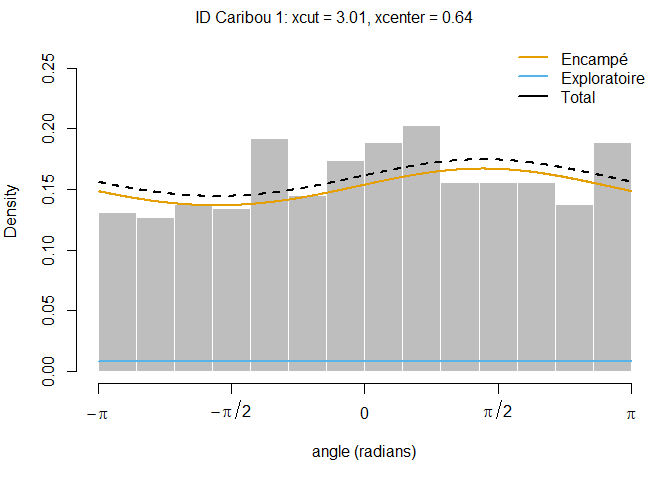

Exemple chapitre 4
================
Aurélien Nicosia

## Package R

``` r
library(tidyverse) # environnement tidyverse
library(oce) # conversion UTM vers longitute/latitude
library(circular) # statistiques directionnelles
library(survival) # modèle de régression logistique conditionnel
library(momentuHMM) # HMM
library(hmmSSF) # Modèle de mélange
library(crawl) # CTCRW
```

## Exemple 4: Traitement de données manquante sur une trajectoire du bison

``` r
file_list <- list.files( pattern = "*.csv", full.names = TRUE, recursive = TRUE)


combined_data <- file_list %>%
  lapply(read.csv2) %>%
  bind_rows()

combined_data <- combined_data %>%
  mutate(long = as.numeric(long), lat = as.numeric(lat))


## une donnée atypique, avec long <-110 (on enleve) et plus grand que -106.4
combined_data <- combined_data %>%
  filter(long > -110 & long< -106.4)


## gestion des dates 

combined_data$datetime <- make_datetime(combined_data$year, combined_data$month,
                                        combined_data$day, combined_data$hour)


### HMM ---


combined_data = combined_data %>% mutate(ID = id)

d <- prepData(combined_data ,coordNames=c("long","lat") ,
              type = "LL" )

#### Multiple inputation ---


bison1045 <- combined_data %>% filter(id == "1045-a", year==2013, month ==12) %>%
  mutate(temps_ecoule = hour - lag(hour), 
         temps_ecoule = ifelse(temps_ecoule>0,temps_ecoule,temps_ecoule+24),
         pas_de_temps = ifelse(temps_ecoule == 1, "1 heure", ifelse(temps_ecoule == 3, "3 heures", "2 heures"))) %>%
  filter(!is.na(temps_ecoule))

bison1045$trajectoire = c("Début", rep("", dim(bison1045)[1]-2), "Fin")

ggplot(data = bison1045, aes(x = long, y = lat))+
  geom_point(aes(color = pas_de_temps))+
  theme_bw()+
  geom_path(color = "grey", size = 0.5)+
  geom_text(data = bison1045[bison1045$trajectoire != "", ], aes(label = trajectoire), vjust = -0.5, hjust = -0.1) +
  xlab("longitute")+ylab("lattitude")+labs(color = "Intervalle de temps")
```

<!-- -->

``` r
bison1045 = bison1045 %>% mutate(ID = id, Time.name= datetime,
                                 x = long, y = lat) %>%
  dplyr::select(ID, Time.name, x, y)

simbison <- crawlWrap(obsData = bison1045,  Time.name = "Time.name", timeStep = "1 hour")
```

    ## Fitting 1 track(s) using crawl::crwMLE...
    ## DONE
    ## 
    ## Predicting locations (and uncertainty) at 1 hours time steps for 1 track(s) using crawl::crwPredict... DONE

``` r
bison <- combined_data %>% filter(id == "1045-a", year==2013, month ==12) %>%
  mutate(temps_ecoule = hour - lag(hour), 
         temps_ecoule = ifelse(temps_ecoule>0,temps_ecoule,temps_ecoule+24),
         pas_de_temps = ifelse(temps_ecoule == 1, "1 heure", ifelse(temps_ecoule == 3, "3 heures", "2 heures"))) %>%
  filter(!is.na(temps_ecoule))


essai = left_join(simbison$crwPredict, bison, by = c("Time.name" = "datetime"))
  


essai$pas_de_temps[is.na(essai$pas_de_temps)] <- "Simulation"
essai$trajectoire = c("Début", rep("", dim(essai)[1]-2), "Fin")


ggplot(data = essai, aes(x = mu.x, y = mu.y))+
  geom_point(aes(color = pas_de_temps))+
  theme_bw()+
  geom_path(color = "grey", size = 0.5)+
  geom_text(data = essai[essai$trajectoire != "", ], aes(label = trajectoire), vjust = -0.5, hjust = -0.1) +
  xlab("longitute")+ylab("lattitude")+labs(color = "Intervalle de temps")
```

<!-- -->

## Exemple 5: Application de la marche aléatoire générale multi-états du chapitre 2 sur les données de caribou avec `momentuHMM`

``` r
# load dataset
jeu <-  read.csv("data/Données complet Article 1 AN (Caribou).txt", sep="")

# Préparation des données
position = matrix(NA, nrow = nrow(jeu)+1, ncol = 2)
position[1,] <- c(0,0)

for (i in 2:(nrow(jeu)+1)){
  position[i,] <- position[i-1,] + jeu[i,]$d*c(cos(jeu[i,]$y),sin(jeu[i,]$y))
}

position = as.data.frame(position)


dat <- cbind(jeu,position[-1,]) 


dat = dat %>% dplyr::rename(direction = y)


# prep data

d <- prepData(dat ,coordNames=c("V1","V2") ,
              type = "LL" )

d = d %>% mutate( ID = "Caribou 1") %>% dplyr::select(-direction, - d)

head(d)
```

    ##          ID      step      angle     xcut   xcenter         x           y
    ## 1 Caribou 1 10.293268         NA 3.403392 0.3406991 0.3465132 -0.06178281
    ## 2 Caribou 1 44.901571 -2.4522243 3.141593 0.1535005 0.2598869 -0.09434139
    ## 3 Caribou 1 24.639558  1.7478629 3.141593 0.4529565 0.4617500  0.25722991
    ## 4 Caribou 1  9.743567  0.1968890 3.141593 1.1190466 0.2536012  0.33301933
    ## 5 Caribou 1 26.912588 -1.7569490 3.141593 0.9552265 0.1670566  0.34620117
    ## 6 Caribou 1 52.141016 -0.7864344 3.403392 1.4442857 0.2468445  0.57595738

``` r
## fit HMM
nbStates <- 2
stepDist <- "gamma" # distribution distance
angleDist <- "vmConsensus" # distribution direction

# initial parameter for distance
stepPar <-  c(1,5,0.5,3)  

# initial parameter for direction
kappa.TA <- c(1.26, 0.02)
kappa.xcut <- c(0.16, 0.14)
kappa.xcenter <- c(0.37, 0.25)


DM = list(angle = list(mean = ~state2(xcut)+state1(xcut)+ 
                         state2(xcenter)+state1(xcenter),
                kappa = ~1))

Par0<-list(step=stepPar,
           angle=c(1,1,0,0,0,0))


m <- fitHMM(data=d,
            nbStates=nbStates,
            dist=list(step=stepDist,angle=angleDist),
            Par0=Par0,
            circularAngleMean = list(angle = TRUE),
            DM = DM,
            stateNames = c("Encampé","Exploratoire"))


par(mfrow = c(4, 3))
plot(m, plotTracks = TRUE)
```

    ## Decoding state sequence... DONE

<!-- --><!-- --><!-- --><!-- --><!-- --><!-- --><!-- --><!-- --><!-- --><!-- --><!-- -->

``` r
par(mfrow = c(1, 1))


plotPR(m)
```

    ## Computing pseudo-residuals...

<!-- -->

``` r
plotStates(m) 
```

    ## Decoding state sequence... DONE
    ## Computing state probabilities... DONE

<!-- -->
